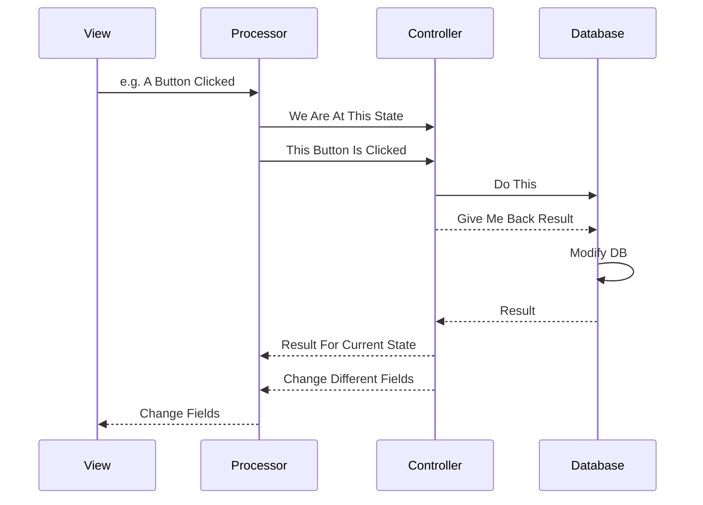
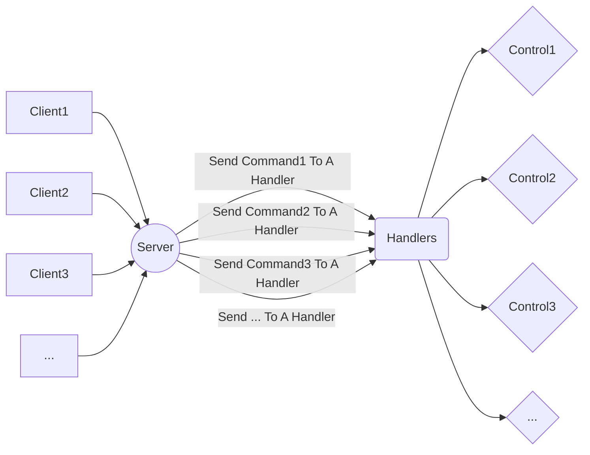

# BoosMarket

Hi! This is team 57 speaking. The following is a quick review of what we did for our java market and what you can expect while checking our project.
This project is result of using lots of caffeine, sleepless nights and a lot of efforts from:
[Ashkan Khademian](https://github.com/ashkan-khd)
[Sepehr Kianian](https://github.com/sepehrkianian09)
[Hossein Aghaei](https://github.com/hossein2079)

## Files
The project contains of 62 java classes, 71 fxml files, and 26 css files and so on. there is a database directory in which there are some default pictures for market products or user profiles for example. 
There is also a prototype database uploaded in repository which you can use to have a greater experience of reviewing our market.
> **WARNING:** Please DO NOT MANIPULATE any of the stated files (except the prototype database) so that no problem would be in running the market.

# Project Phases
### Phase One
- This phase mainly focuses on the back end parts of the code.
- If you are a great fan of the logic behind our market go check this phase.
> Note that this and the next phase do not include any of server-client architecture
- You can also check our SQL database in the model directory.
- The project includes an ORM design so that an existence directory is available in the Model.
- There are several json files which construct a basic ui in command-line.
### Phase Two
- This phase mainly focuses on the front end parts of the code.
-  If you delight GUIs and enjoy material designs you are recommended to see this part of our project.
- We used [JavaFX](https://www.oracle.com/java/technologies/javase/javafx-overview.html) and a bit of CSS files for our market interface and the codes still focus on java language.
### Phase Three
- The last phase of the project which codes are in master branch right now.
- This phase includes all Server-Client architecture which is written in java and uses Java TCP.
- The protocol used for the market API to talk to the server is much alike the REST. There is a Command generic class which is always sent from the client to the server by the postAndGet method. The server also sends an object from Response generic class in return. And from the stated procedure view is updated whenever needed.
>  **Tip**: There is a diagram below which explains our architecture better.

## Logic diagrams

Project used a MVC design pattern on Apache Maven. Following is a simple flow on our project:

This is a flowchart which shows the design pattern we used for our Server.

